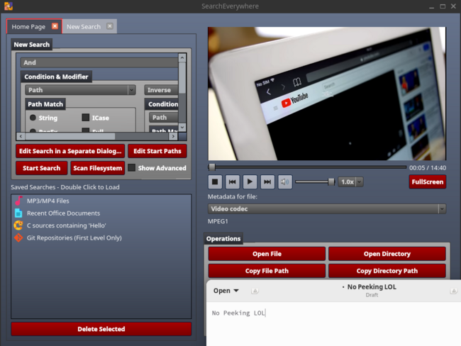
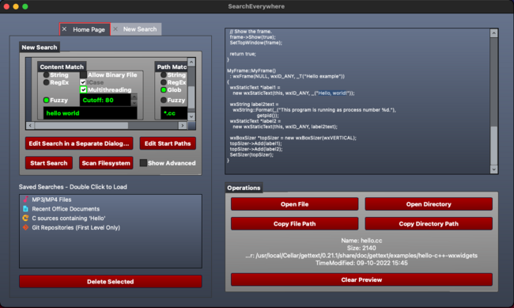
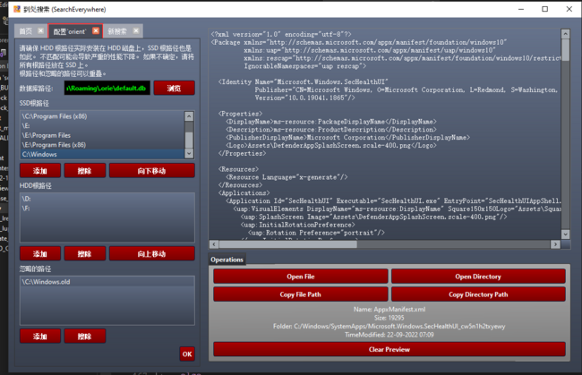
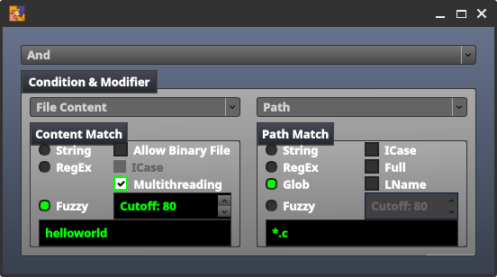
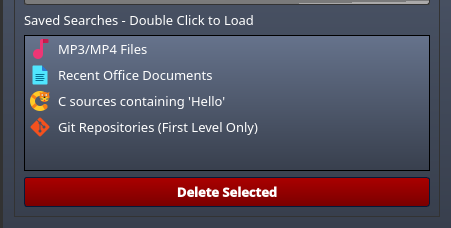

# SearchEverywhere

[简体中文](./README_zh.md)


**Search***Everywhere*  
^ The icon is stolen from [a repo](https://github.com/Jycjmf/SearchEverywhere)
whose name clashed with mine LOL.

The first Fully-Libre GUI File Indexer on macOS and Windows!  
`SearchEverywhere` is a cross-platform GUI filesystem searcher combining the
merits of `find`, `locate` and `Everything`, plus file content searches, plus
an intuitive expression editor allowing easy costruction of complex search
expressions with simple mouse clicks.  
**Works on Linux, macOS and Windows.**

## IMPORTANT NOTES

This README is about the GUI frontend of `orient`. For the CLI and the library,
see [orient](https://github.com/cxxsucks/orient).  
Complete list of features/strengthes/weaknesses unrelated to GUI like
performance and `find` compatibility are also there.

The newest version is `v0.4.0`, which is not stable yet. All the following
demostrations, screenshots are taken on `v0.3.1`.

### Not a Full Blown Content Searcher

While `SearchEverywhere` do offer content searching features, file content
are **NOT** indexed and therefore content searching do not scale well.  
**ALWAYS** use content searches in combination with name matches, or set
a smaller starting point before content searching.

### RAM issue on Linux

For some reason, which seems like a kernel or Qt issue, memory usage on
Linux grows rather quickly. On my laptop with 1.2M files, it starts up
at 65MiB. Several searches and updatedbs later, memory usage skyrockets
before ultimately sitting between 350~400MiB.
(Less than Chromium/Electron😅)

Only on Linux do this happen. On both Windows and macOS, memory usage sit
well below 120MiB when idle, with short spikes to \<200MiB during updatedb,
after which memory usage backs down.

`valgrind` detected no leaking issues either, suggesting it may probably a
framework or system issue. Feel free to talk on issue tracker and discussion
panel here.  
For now however, a good solution is to *restart the app often* as if it
were a memory leaking monster, or better, use linux-y `orient` CLI.

### Client/Server Architecture

Client/Server architectures offer a high extent of code separation, the ability
to connect to remote systems and a higher level of security. In case of `orient`
and `SearchEverywhere` here, that would help `SearchEverywhere` focus entirely
on GUI and less on `orient`'s internal implementation details, boosting
compatibility with older `orient` versions. Meanwhile, searching files
on other computers with `orient` server on would also become possible. (A good
analogy would be SQL servers: they query tables whereas we cuery files.)  
The memory issue may also be solved as long as it is indeed caused by `Qt`
framework.

Unfortunately though, adding a connector layer requires substantial changes on
`orient` and radical changes on `SearchEverywhere`. A connector
will be worked on if this repo reached 256 stars, so smash that star
button if the app proves useful for you or if you find it interesting!

## Comparison

Identical to the `Comparison` section in `orient`  
|              | Linux | Windows | macOS | Android |   License   |
|:------------:|:-----:|:-------:|:-----:|:-------:|:-----------:|
| `Everything` | 👎NO  |  👍YES  | 👎NO  |  👎NO   | Proprietary |
|    `find`    | 👍YES |  👎NO   | 👎NO  |  👎NO   |    GPLv3    |
|  `fsearch`   | 👍YES |  👎NO   | 👎NO  |  👎NO   |    GPLv2    |
|   `locate`   | 👍YES |  👎NO   | 👎NO  |  👎NO   |    GPLv3    |
|   `orient`   | 👍YES |  👍YES  | 👍YES |  👎NO   |    GPLv3    |

Continued Table  
|              | `-and -or` | Invert Index | Match Parent |  GUI  |  CLI  |
|:------------:|:----------:|:------------:|:------------:|:-----:|:-----:|
| `Everything` |   👍YES    |     👎NO     |   Partial    | 👍YES |  😕   |
|    `find`    |   👍YES    |     👎NO     |     👎NO     | 👎NO  | 👍YES |
|  `fsearch`   |   👍YES    |     👎NO     |   Partial    | 👍YES | 👎NO  |
|   `locate`   |   👎NO     |     👍YES    |     👎NO     | 👎NO  | 👍YES |
|   `orient`   |   👍YES    |    👍v0.4+   |     👍YES    | 👍YES | 👍YES |

Notes:

- *Partial*ly matching parent and children means while they do provide
    options to match a file's parent or dir's children, such searches are
    confined to string matches instead of all the app's features.
- `Everything` CLI seems to have all results *prettified*, making it very
    hard to use in combination with other tools, hence the 😕 face.

## GUI Features

Only GUI features are listed here. Non-GUI related features are in
[CLI](https://github.com/cxxsucks/orient) documentation.

### Previewing Content

Once a search finishes, the content of a given result can be previewed at
the right side of the window called `previewer`:  


For previewing to work, `SearchEverywhere` window must be at least 600px
in width, achieved by either stretching by dragging the edge of window by
mouse or maximizing. To turn off previewing, previewed content must be
cleared by clicking *Clear Preview* before dragging the window back to
less than 600px wide.  
Here are a list of document types that can be previewed and the preequisites
in order to preview them:

- All types of images, like `.png .jpg .svg .webm`
    > No animation for `.gif` unfortunately.
- Plain text files
- Rendering static HTML files
    > Not a full-blown browser
- Rendering Markdown files
- Multimedia files like `.mp{3,4} .mov`
    > Require `SEEV_PREVIEW_MEDIA` option be set compile-time  
    > Qt Multimedia does not run my antique MacBook🥹, therefore no media
    > previewing unless manual compilation from source on macOS.
- First page of PDF files
- First page of Office files provided that LibreOffice is installed in PATH
    > ~~which is silly since `orient` is well capable of locating office~~
    > ~~executable by `-name soffice -a -updir bin -a -executable` and the~~
    > ~~PATH requirement simply shows how incompetent the dev is.~~

### Linux, macOS and **Windows**

The First Libre File Indexer Ever on macOS and Windows!😜  
Also localization for 3 languages `fr es` and `zh_CN` are provided. When
opened with system language being one of them (or setting the `LC_ALL` env
variable for testing), the GUI in respective language will show up.
Translations are done via Google Translate so no quality assurance.

Screenshot on macOS and Windows respectively:  
  
  

### Expression Editor

New users are likely to get overwhelmed by the plethora of features thrown
at them. Thankfully, an ugly, yet intuitive, expression editor comes to
rescue:  
  
The expression in this figure searches for all `.c` files whose contents
contain something like `helloworld`.

Usually the editor is situated in the upper-left corner of main page, but
it can turn into a separate dialog for editing pleasure by clicking the
button below when the corner proved too small.  
Matchers Supported by the Editor:

- Always true/false `-true -false`
- Conditional `-and -or`
- Inverse `-not !`
- Path matches `-strstr -bregex -name -fuzz`
- File type `-type`
- File stat `-size -{u,g}id -{a,m,c}{time,min}`
- File content `-content-{strstr,regex,fuzz}`
- File accessibility `-readable -writable -executable`
- Parent and Children `-updir -downdir`
- Prune if (must be used with And) `-prunemod`

## User Guide

### Indexing Configuration

On first startup, users will be asked for the root paths and ignored paths
while indexing. They can be re-configured by clicking `Advanced Options` -
`Edit orient Settings` even after the wizard ends.
Default config works for most devices, but read through to see if yours
belongs to the *most*.

#### Root Paths

Root paths are where filesystem indexing start. For Windows users, these
are typically drive paths like `C:\ D:\`.  
The stock settings may work out of the box, but take note of the `HDD` and
`SSD` root paths. All root paths must correspond to the type of disk it
is on, otherwise indexing speed will suffer a great drop.  
If there are any HDD root paths not listed, be sure to add them.  
When unsure, place all root paths into SSD one, since the majority of modern
computers are running on random-access-friendly SSDs.

#### Ignored Paths

All ignored paths are, well, ignored while indexing.  
Typically infrequently used or volatile paths are ignored, like external
drives, Linux auto filesystems and temporary files. Default setting include
all of them (aside from `/dev /sys` on Linux).

**Windows Users Note**: By default `C:\Windows` is ignored as it is scarsely
accessed by normal users and has *many, many* files, about 1 million or so.
Remove it from ignored paths if you insist on indexing it. According to
previous section, `C:\Windows` should become a root path if it is indexed.  
**Also Note**: Some Windows systems' `C:\Windows` are called `C:\WINDOWS`.
`SearchEverywhere` is case sensitive, therefore double check what your
`C:\Windows` is named if indexing is taking too long.  
On Windows there may be a trailing backslash `\` for each path which are
for Unix conformity and can be ignored.

### Start Indexing

Actually indexing already starts during first time configuration. After that
a message box shows up whose `OK` button become clickable after indexing
finishes. Clicking it brings the main page up.  
The `Cancel` button also brings the main page, but discards indexing process
already made. Do not click it unless substantial changes are made to default
configuration, like moving SSD root path to HDD root path or adding ignored
path.

Clicking `Scan Filesystem` button on main page initiates an index update.
Index update also automatically starts once per hour, but only if
`SearchEverywhere` is left open.  
An index update is needed for configuration edits to take effect.

### Setting Start Points

Unlike root and ignored paths, start points are set per search. By default
the start point is root directory, meaning all indexed files are searched.  
Setting a different start point may be useful for finding files in a smaller
area, but make sure they do not overlap or the overlapped portion will be
searched multiple times.

### Ready, GO

Now it is time for searches! Under the main page are 4 "saved" searches which
demostrates and tests `SearchEverywhere`'s features. Give them a shot to
test if `SearchEverywhere` is actually working.  
  
Searches can be saved for future use and will also appear here.

## Installation

Grab the precompiled binary from Release and they should work.
Windows version additionally requires
[MSVC Runtime](https://learn.microsoft.com/en-us/cpp/windows/latest-supported-vc-redist)

Unfortunalely macOS dmg do not support previewing multimedia😭  
The macOS ARM version is missing since I don't have one such machine🫥.
Feel free to report whether it works on issue or discussion.
> Currently this app is too little-tested to release to a distribution.  
> May release to Arch AUR first btw.

### Build from Source

Building from source is recommended in the early stage of release.
Give it a shot!  
Build dependencies:

- Qt Widgets
- Qt Multimedia (Multimedia Preview Only)
- CMake
- PCRE2
- rapidfuzz
- GoogleTest (`orient` Test Only)

Aside from `CMake & Qt`, dependencies can be auto-downloaded by CMake.  
Using an installed one is also possible, should you have already
installed some of them, via toggling configure options below.

Configure Options:

- `SEEV_PREVIEW_MEDIA`: Enable previewing multimedia
- `ORIE_TEST`: Build GoogleTest test suites
- `ORIE_SYSTEM_PCRE2`: Use System PCRE2 Library instead of compiling
    a new one.
- `ORIE_LINK_STATIC`: Statically link orient executable
- `ORIE_SYSTEM_RAPIDFUZZ`: Use System rapidfuzz Library (header only)

> `rapidfuzz` has some issues with building as sub project so
> `SEEV_SYSTEM_ORIENT` is not stable (yet).

Replace the `OPTION` below with your enabled options, and run the
following commands:

```sh
git clone https://github.com/cxxsucks/SearchEverywhere.git
cd orient; mkdir build; cd build
cmake -DOPTION1=ON -DOPTION2=ON -DCMAKE_BUILD_TYPE=Release ..
make -j$(nproc)
sudo make install
```

### Build Linux AppImage

TODO (not as easy as it may seem due to Qt deployment plugin bug)

## Credits

### The Name and Icon

While aimlessly browsing DuckDuckGo and GitHub for an icon of *this*
`SearchEverywhere`, I came across another
[SearchEverywhere](https://github.com/Jycjmf/SearchEverywhere).  
It seems to be Windows only and dependent on non-*free-as-in-freedom*
`Everything`, which kinda ruins the purpose of it using *free-as-in-freedom*
GPLv3 license. Despite lacking core functionalities, its UI is miles ahead
this `SearchEverywhere`'s and, above all, contains an icon that
is literally defined for `SearchEverywhere`.

And, per Stallman's wish, I declared the icon independent of its original
non-free dependency `Everything`, aka, stole it.  

Do [check that SearchEverywhere out](https://github.com/Jycjmf/SearchEverywhere),
even though it is in Chinese and **MSWindows Only😭**.

### Others

- Qt for GUI Framework
- LibreOffice for Office document previewing
